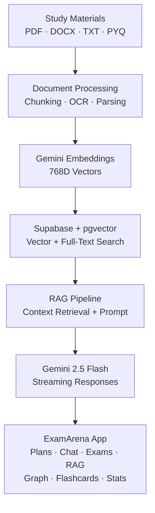

<div align="center">

# ExamArena

### AI-Powered Exam Preparation Platform

AI-powered study planning, RAG-based learning, adaptive revision, and interactive exam preparation in one platform.

[](https://examarena-in.vercel.app)&nbsp;&nbsp;
[](https://nextjs.org/)&nbsp;&nbsp;
[](https://react.dev/)&nbsp;&nbsp;
[](https://www.typescriptlang.org/)&nbsp;&nbsp;
[](https://supabase.com/)&nbsp;&nbsp;
[](https://ai.google.dev/)

</div>

---

## Overview

**ExamArena** is an AI-powered exam preparation platform that turns syllabus PDFs, lecture notes, and previous-year questions into personalized study workflows.

It combines **RAG**, semantic vector search, AI-generated assessments, interactive knowledge graphs, and **SM-2 spaced repetition** to help students plan, learn, practice, and revise from a single platform.

🌐 **[Live Demo →](https://examarena-in.vercel.app/)**

---

## Key Features

### AI-Powered Study Planning

- Generates structured, unit-by-unit study plans from uploaded learning material
- Produces long-answer questions, short-answer questions, and MCQs
- Provides contextual study tips and learning resources
- Streams AI-generated content in real time

### RAG-Based AI Tutor

- Processes uploaded PDFs, documents, and study material
- Generates embeddings for semantic retrieval
- Combines vector search with full-text search
- Uses retrieved context to generate grounded responses
- Supports streaming AI chat and contextual explanations

### Interactive Knowledge Graph

- Builds relationships between syllabus topics
- Represents prerequisites, related topics, extensions, and examples
- Provides interactive topic exploration
- Generates contextual explanations for selected topics

### Spaced Repetition

- Generates flashcards from study material
- Implements the **SuperMemo SM-2 algorithm**
- Tracks ease factor, review interval, and next review date
- Supports active recall and scheduled revision

### AI Mock Exams

- Generates multiple-choice mock examinations
- Provides automated scoring
- Includes answer explanations
- Tracks assessment performance

### Student-Focused Experience

- Focus Mode for distraction-free studying
- Light and dark themes
- Responsive interface
- Print-friendly study material
- Public sharing of generated study plans
- PWA support

---

## System Architecture


## AI & Retrieval Pipeline

ExamArena uses a hybrid retrieval architecture rather than relying exclusively on LLM generation.

### Document Ingestion

```text
Document
   ↓
Text Extraction / OCR
   ↓
Chunking
   ↓
Gemini Embedding
   ↓
768D Vector
   ↓
Supabase pgvector
```

### Hybrid Retrieval

The retrieval layer combines:

- Dense vector similarity search
- PostgreSQL full-text search
- Reciprocal Rank Fusion (RRF)
- Metadata and document filtering

Retrieved context is then passed to the AI generation pipeline.

### AI Response Pipeline

```text
User Question
     ↓
Query Analysis
     ↓
Relevant Context Retrieval
     ↓
Context Assembly
     ↓
Gemini 2.5 Flash
     ↓
Streaming Response
     ↓
Markdown / LaTeX / Mermaid Rendering
```

---

## Technology Stack

| Area | Technology |
| :--- | :--- |
| **Framework** | Next.js 16 |
| **Frontend** | React 19 |
| **Language** | TypeScript 5 |
| **Styling** | Tailwind CSS v4 |
| **AI / LLM** | Google Gemini 2.5 Flash |
| **Embeddings** | Gemini Embedding |
| **Vector Database** | Supabase pgvector |
| **Database** | PostgreSQL |
| **Authentication** | Supabase Auth |
| **Visualization** | Recharts, Mermaid.js |
| **Animation** | Framer Motion |
| **PWA** | next-pwa |
| **Build** | Turbopack / Webpack |
| **Deployment** | Vercel |

---

## Repository Structure

```text
exam-ai-platform/
├── app/
│   ├── actions/
│   ├── api/
│   │   ├── chat/
│   │   ├── extract-flashcards/
│   │   ├── generate-exam/
│   │   ├── generate-plan/
│   │   ├── knowledge-graph/
│   │   └── subjects/
│   ├── arena/
│   ├── chat/
│   ├── components/
│   │   ├── ai/
│   │   ├── layout/
│   │   └── study/
│   ├── history/
│   ├── settings/
│   ├── share/
│   ├── globals.css
│   └── layout.tsx
│
├── lib/
│   ├── ai/
│   ├── analytics/
│   ├── embeddings.ts
│   ├── spacedRepetition.ts
│   └── supabaseAdmin.ts
│
├── public/
├── supabase_multi_tenant.sql
├── supabase_graph.sql
├── supabase_analytics.sql
├── supabase_session_resume.sql
├── next.config.ts
└── package.json
```

---

## Getting Started

### Prerequisites

- Node.js 20+
- npm, pnpm, or bun
- Supabase project
- Google Gemini API key
- `pgvector` enabled in Supabase

### 1. Clone the Repository

```bash
git clone https://github.com/Sachin10e/Exam-Arena.git
cd Exam-Arena
```

### 2. Install Dependencies

```bash
npm install
```

### 3. Configure Environment Variables

Create `.env.local`:

```env
NEXT_PUBLIC_SUPABASE_URL=https://your-project.supabase.co
NEXT_PUBLIC_SUPABASE_ANON_KEY=your-supabase-anon-key
SUPABASE_SERVICE_ROLE_KEY=your-supabase-service-role-key

GEMINI_API_KEY=your-google-gemini-api-key
```

> Never commit `.env.local` or expose service-role credentials.

### 4. Configure the Database

Run the required SQL migration files from the repository in the Supabase SQL Editor:

```text
supabase_multi_tenant.sql
supabase_graph.sql
supabase_analytics.sql
supabase_session_resume.sql
```

### 5. Start Development

```bash
npm run dev
```

Open [http://localhost:3000](http://localhost:3000).

---

## Available Scripts

| Command | Purpose |
| :--- | :--- |
| `npm run dev` | Start development server |
| `npm run build` | Create production build |
| `npm run start` | Start production server |
| `npm run lint` | Run ESLint |

---

## Deployment

ExamArena is deployed using **Vercel**.

**Live Application:**  
[https://examarena-in.vercel.app](https://examarena-in.vercel.app)

For production deployment:

1. Import the repository into Vercel.
2. Configure the required environment variables.
3. Connect the Supabase project.
4. Deploy the application.

---

## Security

The application uses Supabase authentication and Row Level Security to isolate user data.

Sensitive credentials should remain server-side and must never be committed to the repository.

Required secrets include:

```text
SUPABASE_SERVICE_ROLE_KEY
GEMINI_API_KEY
```

---

## Future Improvements

- Improved adaptive learning recommendations
- Additional AI-powered assessment modes
- More detailed learning analytics
- Expanded document-processing support
- Enhanced offline/PWA capabilities
- Additional retrieval and ranking strategies

---

## Author

**Sachin Ellakar**

[GitHub](https://github.com/Sachin10e)&nbsp;&nbsp; · &nbsp;&nbsp;[LinkedIn](https://www.linkedin.com/in/sachin-ellakar/)&nbsp;&nbsp; ·&nbsp;&nbsp; [Live Demo](https://examarena-in.vercel.app)

---

<div align="center">

**ExamArena — Learn smarter. Prepare better.**

</div>
